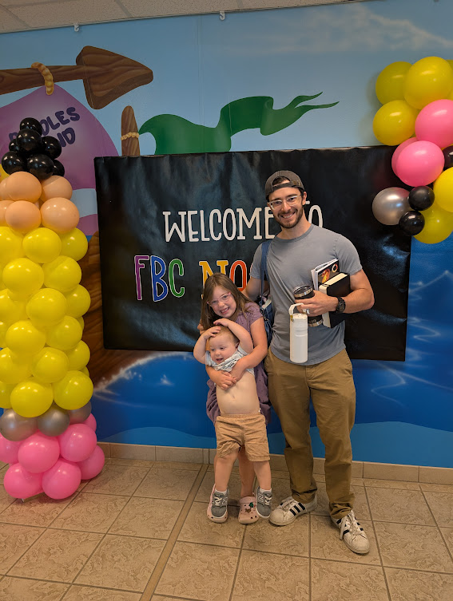
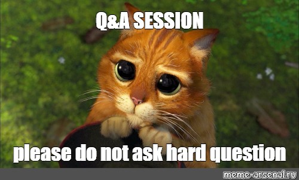

# Garison High School Career Day
Exploring a career in Technology
David Young, Principal Software Engineer @ Thomson Reuters

---

# Who is David

- Software Engineer for 11+ years
- Raised in Center, TX
- Graduate of SFASU, '14
- Husband to Lauren, and Dad to Ruby and Bennie

---

# What is a Software Engineer?

- Creates and maintains programs of all kinds
- Games, browser based programs, desktop, phones, and server
- Involves a lot of problem solving and trying to turn ideas into things you can use.

---

# What do I do?

- Principal Engineer in a Research and Development Organization
- Primarily responsible for a platform that reads documents
- Coaching other software engineers
- Set organizational technical strategy across several projects

---

# Day in the Life

- Begins with email and making a plan for the day
- Morning - Meetings & Planning with EU colleagues
- Squeeze in a lunch, sometimes at home or on the go
- Afternoon - Coding, planning, meetings with NA colleagues
- Finish out the day with a list of priorities for tomorrow

---

# Ok cool, what else is there in Tech?

- Product Management
- Data Science
- Design
- System Engineering
- IT Administration
- Engineering Management
- Customer Success/Account Managers/Sales

---

# Why start a career in tech?

- Money 💸
- New problems every day, rarely stale 💭
- Opportunities to work from home 🏡
- Diverse groups of people from all walks of life 💁
- Every industry is becoming a technology industry 🧑‍💻

---

# How to get started

- Focus on problem solving
- Get curious online, tons of great content on YouTube. 
  - Check out Python!
- Build something small
- Don't be afraid to break things!

---

# What are some of the downsides?

- New problems every day 😂
- Occassional long hours, especially if you are on call ☎️
- Periods of stress when aiming to hit a deadline for a release 🕛
- Challenging to get everyone on the same page and goal 📃

---

# My Journey

- In high school I really didn't know what I wanted to do
- When do you think I got my first job? What was it?

---

# Early Career Timeline

- Job 1 (15): Janitor at a doctor's office
- Job 2 (16): Makin' popcorn at the Rio Theater!
- Job 3 (17 - 18): Part-Time computer tech for CISD
- Job 4 (18 - 19): Barista
  - started school at Panola College
- Job 5 (19 - 21): Computer Tech for SFASU
  - started school at SFASU, majoring in IT
- Job 6 (22): Software Engineer while finishing up college

---

# Questions!

